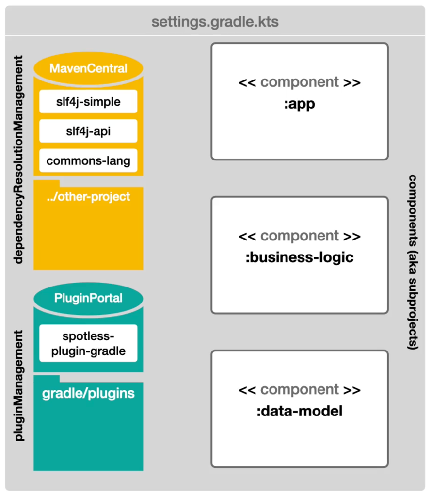

## dependencyResolutionManagement

실제로 의존성을 불러오는 것은 아니고 경로만 설정한다.

### repositories

- look in remote repository to potentially find the component there

### includeBuild

- include other gradle build

## pluginManagement

plugin 관련 설정

### includeBuild

- should write local plugin

## rootProject.name

give name to project, default is directory name



## build.gradle

plugins

- should always have a plugin block in the top
- application
    - adds functionality for packaging and running java applications

## Dependency types

| Type           | Description                                                                                                                                                                   | When to use                                                                                                                                                                                 |
|----------------|-------------------------------------------------------------------------------------------------------------------------------------------------------------------------------|---------------------------------------------------------------------------------------------------------------------------------------------------------------------------------------------|
| api            | Used both during compilation and at runtime and is exported to library consumers.                                                                                             | If any type from a dependency is used in the public API of the current module, use an api dependency.                                                                                       |
| implementation | Used during compilation and at runtime for the current module, but is not exposed for compilation of other modules depending on the one with the `implementation` dependency. | Use for dependencies needed for the internal logic of a module. If a module is an endpoint application which is not published, use implementation dependencies instead of api dependencies. |
| compileOnly    | Used for compilation of the current module and is not available at runtime nor during compilation of other modules.                                                           | Use for APIs which have a third-party implementation available at runtime.                                                                                                                  |
| runtimeOnly    | Available at runtime but is not visible during compilation of any module.                                                                                                     |                                                                                                                                                                                             |

## java plugin

```kotlin
java {
    toolchain.languageVersion.set(JavaLanguageVersion.of(20))
}
```
- set java version 

